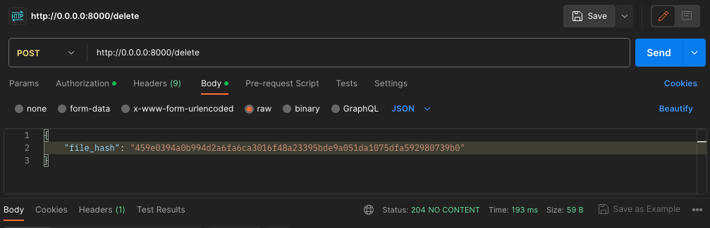

# File Storage API

This project is an implementation of a Flask REST API 
that store files on the server.

The API supports all file types.

You can find samples of different files type in the `samples` folder.

## Setup

### Locally

You can deploy the API locally on your computer:

#### 1. Clone repository
```commandline
git clone https://github.com/RolfAdolf/file-storage.git

cd file-storage
```

#### 2. Create Virtual Environment

Create virtual environment with `pyenv` or `poetry`.

```commandline
python3 -m venv venv
source venv/bin/activate

pip install -r requirements.txt
```

#### 3. Set the `.env`-file

Before the API deployment, you need to create an environment file `.env` with the following fields, 
as shown below. Place this file in the root directory of the repository.

```commandline
# Postgres DB connection
POSTGRES_HOST=********
POSTGRES_PORT=********
POSTGRES_DB=**********
POSTGRES_USER=********
POSTGRES_PASSWORD=****

UPLOAD_FOLDER='./storage'
# 10 megabytes
MAX_CONTENT_LENGTH=10485760

# The user that is created by default
ADMIN_USERNAME=*********
ADMIN_PASSWORD=*********

SECRET_KEY=*********
```


#### 4. Apply migrations

```commandline
flask db migrate -m "First commit"

flask db upgrade
```

#### 5. Run the server

Run the wsgi server.

```commandline
uwsgi --socket 0.0.0.0:8000 --protocol=http -w src.wsgi.wsgi:app
```


#### Remark

This implementation uses PostgreSQL, but you can use any other 
compatible database, including SQLite (Edit the Connection string).


### Docker

The Docker is the easiest way to deploy the API. It will only take one command:

```commandline
docker compose up
```


### Tests

You can test the code with the following command:

```commandline
python3 -m unittest tests

# or

python3 -m unittest tests.test_integration

# or

python3 -m unittest tests.test_unit
```


### API instruction


You can try out the API in different ways:


#### `requests` library

```commandline
>>> import requests
>>> from requests.auth import HTTPBasicAuth
>>> url = "http://0.0.0.0:8000/upload"
>>> response = requests.post(url, auth=auth_header, files={"file": ('test_file.jpeg', open('./samples/file_example_JPEG_4MB.jpeg', 'rb').read(), 'image/jpeg')})
>>> response.json()
{'file_hash': 'b6f1033d3923adc10c499874d8ed7b2df1b317cc646e3fa7ee81ec49854c5baf'}
```


#### Postman App

##### Set the Basic Authorization header


##### Upload


##### Delete




***
### Contacts
For all questions, please contact:

`Telegram`: @Nadir_Devrishev

`Mail`: nadir.dewrishew@gmail.com
